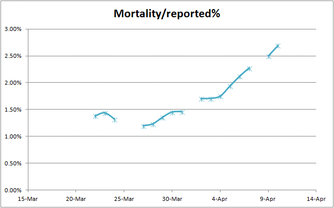

Tracking and Projecting COVID-19 in USA
=======

Mostly CDC Data for confirmed cases and deaths.
-----------
Filename: COVID-19_ GrowthProjectionsAndCDC_USA.xlsx

By Forrest Lee Erickson

License: I release this to the Public Domain, Credit me if you want.

This spread sheet has two smple exponential functions. I can set a daily growth rate for each which I have chosen to bracket the data so far received from the CDC web site at: https://www.cdc.gov/coronavirus/2019-ncov/cases-updates/cases-in-us.html#2019coronavirus-summary
That web site does not provide data during the weekend so the graph of actual data is discontinious.
**Note: data on 28 and 29 March is from JHU.

It is my hope to see the confiremd cases depart from an exponental growth and platau soon. 

As of April 1, 2020

---
Science works. Nothing fails like prayer.
